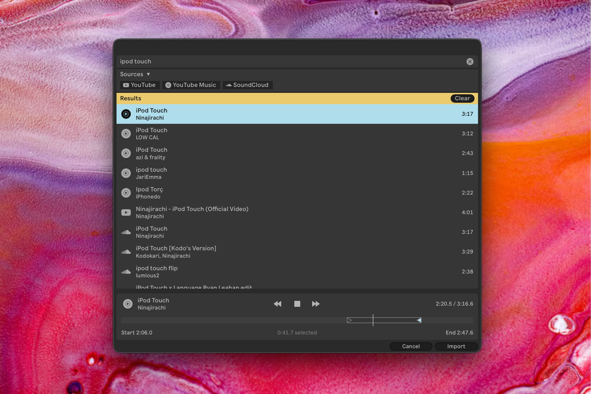
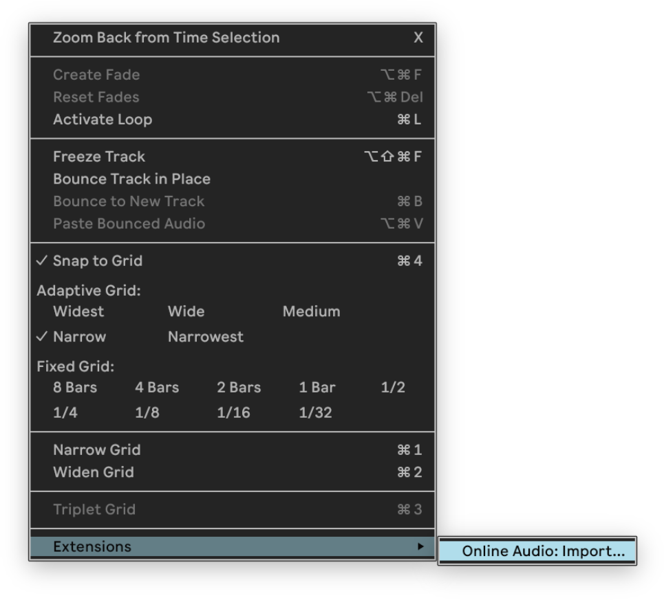

# Online Audio for Ableton Live

**Find and import online audio without leaving Ableton Live.**

Online Audio searches YouTube, YouTube Music, and SoundCloud inside Ableton Live. Preview and trim a result, then import the full track or selected range into a clip slot or Arrangement track.

<p align="center">
  <a href="../../releases/latest/download/Online-Audio.ablx"><strong>Download extension (.ablx)</strong></a>
</p>

> Requires **Ableton Live 12.4.5 public beta** with Extensions.

<p align="center">
  
</p>

## How to use

<p align="left">
  
</p>

1. Right-click a clip slot, an Arrangement selection, or an audio track.
2. Choose **Extensions → Online Audio: Import…**
3. Search for a song or paste a YouTube, YouTube Music, or SoundCloud URL.
4. Pick a result to preview it.
5. (Optional) Drag the timeline's **Start** and **End** handles to select a range.
6. Click **Import**. The selected audio would be placed in your set.

## Install

1. [Download the extension](../../releases/latest/download/Online-Audio.ablx).
2. Open Live's **Settings**.
3. Select the **Extensions** tab.
4. Drag `Online-Audio.ablx` into the **Drag and drop to install** area.
5. Turn off **Developer Mode** if it is enabled.
6. Quit and reopen Live.

Packaged extensions do not appear while Developer Mode is active.

## Requirements

- Ableton Live 12.4.5 public beta with Extensions

On the first import, the extension downloads managed `yt-dlp` and verified FFmpeg binaries into Live's extension storage (about 69-88 MB combined, depending on the platform). Both downloads are automatic.

The extension checks `yt-dlp` for updates about once a day; its pinned FFmpeg version updates with the extension.

## Use audio responsibly

Download only audio you have permission to use. Follow copyright law and each source's terms of service.

<details>
<summary><strong>Development and packaging</strong></summary>

### Set up

Get the Ableton Extensions SDK tarballs described in [`vendor/README.md`](vendor/README.md), then run:

```bash
npm install
cp .env.example .env
# Set EXTENSION_HOST_PATH in .env to your Live Beta application.
# In Live, enable Preferences → Extensions → Developer Mode.
npm start
```

The SDK tarballs are proprietary and must not be redistributed.

### Build a package

```bash
npm run package
```

The package command produces a versioned `Online-Audio-<version>.ablx` file.

### Publish a download

Attach the build to a GitHub Release with the asset name `Online-Audio.ablx`. The download links at the top of this README always target that file in the latest release.

</details>

## Open source

The source code is available under the [MIT License](LICENSE).

Managed [FFmpeg](https://ffmpeg.org/) binaries come from [Shaka Project's reproducible builds](https://github.com/shaka-project/static-ffmpeg-binaries) and are licensed separately under the GPL. Their version, checksum, source, and license information are saved beside the downloaded binary.
